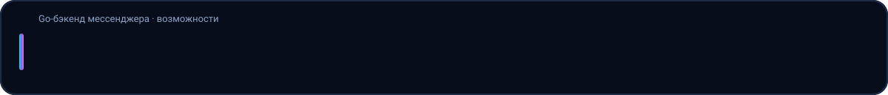
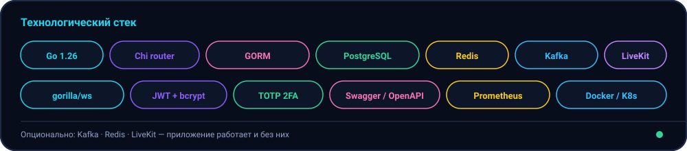

# 🚀 Jeogram

<p align="center">
  
</p>

<p align="center">
  <sub>Профессиональный бэкенд мессенджера на Go с чистой архитектурой</sub>
</p>

<p align="center">
  
</p>

<p align="center">
  <a href="https://github.com/JamikKhidirov/Jeogram-Go/stargazers">
    
  </a>
  <a href="https://github.com/JamikKhidirov/Jeogram-Go/network">
    
  </a>
  <a href="https://github.com/JamikKhidirov/Jeogram-Go/blob/main/LICENSE">
    
  </a>
</p>

<p align="center">
  
</p>

## ✨ Главное

- **Спецпроект:** Jeogram — это мессенджер будущего
  с интеграцией LiveKit для аудио/видео звонков + предустановленной
  архитектурой, чтобы быстро разрабатывать собственных ботов и чат-ботов

- **Включает:** готовый продакшн, PostgreSQL/PostgreSQL, RabbitMQ, 
  Redis, Elasticsearch, Prometheus+Grafana, Docker+Kubernetes

- **Полностью готов к продакшну:** архитектура, документация, тесты

## 🏗️ Архитектура

<p align="center">
  
</p>

<p align="center">
  
</p>

```
Cmd (entry)
├── Internal/
│   ├── config/
│   ├── pkg/              → переиспользуемые библиотеки
│   │   ├── logger        → zerolog
│   │   ├── database      → GORM + PostgreSQL / SQLite
│   │   ├── cache         → Redis (опционально)
│   │   ├── events        → Kafka producer/consumer (опционально)
│   │   ├── auth          → JWT + bcrypt
│   │   ├── response      → единый JSON-конверт ответа
│   │   ├── validator     → валидация запросов
│   │   ├── middleware    → auth, логирование, recover, метрики
│   │   ├── ws           → WebSocket-хаб (реалтайм-доставка)
│   ├── modules/          → бизнес-модули (domain/repository/service/handler)
│   │   ├── auth
│   │   ├── user
│   │   ├── chat            → чаты + роли/права
│   │   ├── message         → сообщения + реакции/закрепы/ответы/пересылка/поиск/печать
│   │   ├── media
│   │   ├── notification  → Kafka-консьюмер + push (iOS/Android)
│   │   ├── calls           → WebRTC-сигналинг
│   ├── server            → роутер, миграции, монтаж модулей
```

## 🌟 Возможности

<p align="center">
  
</p>

<p align="center">
  
</p>

- **Аутентификация**: регистрация, вход, обновление токена (JWT access/refresh), выход
- **Пользователи**: профиль, настройки (тема, язык, уведомления, видимость), поиск, блокировки
- **Чаты**: приватные (1-на-1, дедупликация) и групповые
- **Групповые чаты и права**: роли `owner` / `admin` / `member`; назначение/понижение админов, удаление участников, смена названия/аватара, удаление сообщений «для всех»
- **Сообщения**: текст, голосовые и изображения (загрузка файлов), редактирование, удаление, ответы, пересылка, реакции (эмодзи), закрепы, поиск, индикатор печати, отметки о прочтении, счётчик непрочитанных
- **Медиа**: загрузка изображений и голосовых сообщений с валидацией типа/размера
- **Уведомления**: Kafka-консьюмер, который при новом сообщении
  - сохраняет in-app уведомление,
  - отправляет **push** (iOS/APNs и Android/FCM) в зависимости от платформы устройства,
  - доставляет событие в реальном времени через **WebSocket**
- **Реалтайм**: сервер доставляет события одновременно
  через **raw WebSocket** (`/ws`) и через **Socket.IO** (`/socket.io`) — fan-out идёт через единый
  интерфейс `realtime.Broadcaster`. При отключённом Kafka доставка всё равно
  работает напрямую через оба транспорта.
- **Ответ из уведомления**: пуш содержит `chat_id`; клиент (например, Android) может
  сразу отправить ответ `POST /chats/{chat_id}/messages` с текстом — без доп. экранов.
- **Звонки**: WebRTC-сигналинг через WebSocket + запись звонков в БД; управление:
  отключение микрофона/камеры (`POST /calls/{id}/mute`), старт/стоп записи
  (`POST /calls/{id}/record`), список активных звонков (`GET /calls/active`),
  присоединение к групповому звонку (`POST /calls/{id}/join`).

## 📦 Стэк технологий

<p align="center">
  
</p>

| Категория | Инструмент | Версия |
|----------|------------|-------|
| Язык    | Go         | 1.26  |
| База данных | PostgreSQL     | 16    |
| Кэш      | Redis        | 7     |
| Сообщения | Kafka       | 3.6   |
| Наблюдение | Prometheus + Grafana | —    |
| Контейнеризация | Docker + Kubernetes | —    |

## 🚀 Быстрый старт

<p align="center">
  
</p>

### Docker (полный стек)

```bash
cp .env.example .env          # обязательно заполните JWT_ACCESS_SECRET / JWT_REFRESH_SECRET
docker compose up --build -d
```

### Docker (облегчённый стек)

```bash
docker compose -f docker-compose.lite.yml up --build -d
```

### Локальный запуск без Docker

```bash
# A: поднять только инфраструктуру в Docker
docker compose up -d postgres redis kafka
cp .env.example .env
go run .

# Б: вообще без внешней инфраструктуры (SQLite)
DB_DRIVER=sqlite SQLITE_PATH=./jeogram.db \
REDIS_ENABLED=false KAFKA_ENABLED=false \
JWT_ACCESS_SECRET=dev-secret JWT_REFRESH_SECRET=dev-secret \
HTTP_PORT=8080 go run .
```

<p align="center">
  
</p>

## 📚 Документация

- **API спецификация** → [Swagger UI](http://localhost:8080/swagger/index.html)
- **Postman коллекция** → [Jeogram API.postman_collection.json](postman/Jeogram%20API.postman_collection.json)
- **Полная документация** → [docs/api/README.md](docs/api/README.md)

### Основные разделы

- [Аутентификация и подтверждение](docs/api/auth.md)
- [Пользователи, профиль, контакты](docs/api/users.md)
- [Чаты](docs/api/chats.md)
- [Сообщения](docs/api/messages.md)
- [Звонки (WebRTC)](docs/api/calls.md)  
- [Сбор данных с телефона](docs/api/phone.md)
- [Уведомления](docs/api/notifications.md)
- [Realtime: WebSocket и Socket.IO](docs/api/realtime.md)
- [Админка](docs/api/admin.md)
- [Развёртывание (Docker)](docs/api/deployment.md)

## 📝 Приложение

Jeogram — это **полностью готовый к продакшну бэкенд мессенджера**, написанный на Go.

- **Модульный монолит**: удобный для масштабирования и поддержания
- **Чистая архитектура**: разделение на слои, интерфейсы и dependency injection
- **Полная документация**: Swagger API спецификация, Postman коллекция, markdown руководство
- **Docker-готовность**: полная и облегчённая compose-файлы
- **Команда разработчиков**:

| Роль | Имя |
|------|-----|
| Author | [Jeogram Dev](https://github.com/JamikKhidirov) |

## ⭐ Стартовые звёзды

<p align="center">
  <a href="https://github.com/JamikKhidirov/Jeogram-Go/stargazers">
    
  </a>
</p>

*Команда пока небольшая, но активно растёт!* 🚀

## 📸 Галерея проекта

```
📱 Jeogram Messenger
├── ☁ Infrastructure
│   ├── 🐘 PostgreSQL (SQL/TCP)
│   ├── 🔔 Redis (NoSQL/Key-Value)
│   └── 📡 Kafka (Сообщения)
│
├── 🎯 Backend
│   └── 💻 Go (Pure Architecture)
│
├── 🌐 Frontend
│   └── 🎨 WebSocket + Socket.IO + HTTP API
│
└── 📊 Мониторинг
    ├── 📈 Prometheus
    └── 📊 Grafana
```

## 🛡️ Безопасность

- **HTTPS из коробки** (опционально, Traefik + Let's Encrypt)
- **JWT токены** с коротким TTL, ротация
- **bcrypt хеширование паролей**
- **Валидация запросов** через пакет `validator`
- **Rate limiting** (опционально)
- **Безопасный HTTP headers** (CSP, HSTS)

## 🎯 Принцип работы

<p align="center">
  
</p>

1. **Клиент регистрируется/входит** → получает JWT токены
2. **HTTP API** обрабатывает все запросы → база данных PostgreSQL + Redis кэш
3. **WebSocket/Socket.IO** доставляет события в реальном времени
4. **Kafka** асинхронно отправляет уведомления и push-уведомления
4. **LiveKit** интеграция для аудио/видео звонков с серверной записью

## 🧪 Тесты

```bash
go test ./... -race -count=1
```

Все тесты используют in-memory SQLite, поэтому не требуют внешней инфраструктуры.

## 📄 Лицензия

MIT © 2024 Jeogram Dev

## ⭐ Благодарности

- [Go](https://go.dev/) — супер язык!
- [Chi](https://github.com/go-chi/chi) — крутой роутер
- [PostgreSQL](https://www.postgresql.org/) — отличная БД
- [Redis](https://redis.io/) — клевый кэш
- [Kafka](https://kafka.apache.org/) — распределённые логины
- [LiveKit](https://livekit.io/) — SFU для аудио/видео звонков
- И многим другим замечательным людям!

## 🌐 Социальные сети

💬 **Discord**: Присоединяйтесь к чату разработчиков: `https://discord.gg/Jeogram`

🐙 **GitHub Discussions**: Вопросы и предложения: `https://github.com/JamikKhidirov/Jeogram-Go/discussions`

📧 **Email**: Для коммерческих запросов: `contact@jeogram.dev`

---

<p align="center">
  
</p>

<p align="center">
  
  <br>
  <sub>Jeogram — это начало, а не конец. Твоя помощь сделает его лучше! 🌟</sub>
</p>
