  

# Socket.IO — УДАЛЁН

Socket.IO (`/socket.io`) **удалён** из проекта. Реалтайм-доставка теперь работает
только через **raw WebSocket** (`/ws`).

Для realtime-событий используйте `ws://localhost:8080/ws?token=<access_token>`.
Подробнее: [WEBSOCKET.md](WEBSOCKET.md).
