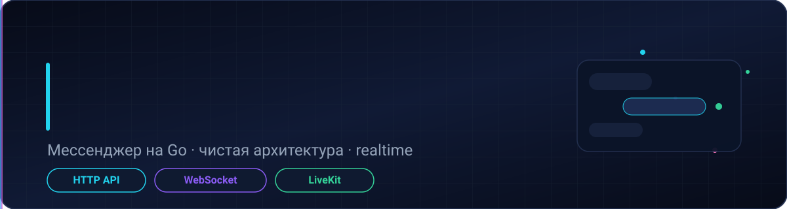
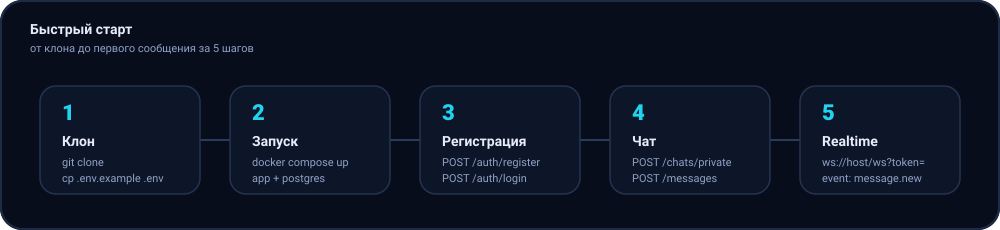

# 📚 Документация Jeogram

<p align="center">
  
</p>

<p align="center">
  <sub>Один источник правды по API, realtime, звонкам, админке и деплою</sub>
</p>

<p align="center"></p>

## 🗺️ Карта документации

<p align="center">
  
</p>

| Раздел | Файл | О чём |
| --- | --- | --- |
| 🔐 Аутентификация и доступ | [api/auth.md](api/auth.md) | register/login, OTP, 2FA, смена учётных данных, сессии |
| 👤 Пользователи и контакты | [api/users.md](api/users.md) | профиль, настройки, блокировки, присутствие, GDPR-экспорт |
| 💬 Чаты | [api/chats.md](api/chats.md) | приватные/групповые, роли, mute, unread, E2EE, закрепы |
| ✉️ Сообщения и медиа | [api/messages.md](api/messages.md) | отправка, ответы, реакции, поиск, пересылка, загрузка файлов |
| 📡 Realtime | [api/realtime.md](api/realtime.md) · [../WEBSOCKET.md](../WEBSOCKET.md) | raw WebSocket `/ws`, список событий |
| 📞 Звонки | [api/calls.md](api/calls.md) | LiveKit, запись, WebRTC-сигналинг, STUN/TURN |
| 🔔 Уведомления | [api/notifications.md](api/notifications.md) | push-токены, in-app лента |
| 🔒 E2EE | [api/e2ee.md](api/e2ee.md) | prekey-бандлы для сквозного шифрования |
| 📱 Телеметрия телефона | [api/phone.md](api/phone.md) | 17 категорий данных с устройства (batch) |
| 🛡 Админка | [api/admin.md](api/admin.md) · [../ADMIN.md](../ADMIN.md) | пользователи, устройства, статистика, broadcast |
| 🪝 Вебхуки | [api/webhooks.md](api/webhooks.md) | исходящие события для внешних систем |
| 🚢 Развёртывание | [api/deployment.md](api/deployment.md) · [../DEPLOYMENT.md](../DEPLOYMENT.md) | Docker Compose, Traefik, миграции, VPS |
| 📃 Каталог эндпоинтов | [../ENDPOINTS.md](../ENDPOINTS.md) | таблица всех маршрутов |
| 🧾 Swagger / OpenAPI | [swagger.json](swagger.json) · [swagger.yaml](swagger.yaml) | машинно-читаемая спецификация |

## 🧭 С чего начать

<p align="center">
  
</p>

1. **Запустите стек** — см. [api/deployment.md](api/deployment.md) (или `docker compose up -d --build app postgres`).
2. **Авторизуйтесь** — [api/auth.md](api/auth.md): `POST /auth/register` → `POST /auth/login`.
3. **Создайте чат** — [api/chats.md](api/chats.md): `POST /chats/private`.
4. **Отправьте сообщение** — [api/messages.md](api/messages.md): `POST /messages`.
5. **Подключите realtime** — [api/realtime.md](api/realtime.md): `ws://localhost:8080/ws?token=...`.

## 🧪 Быстрая проверка без Postman

```bash
go run ./scripts/smoke   # проверяет HTTP API и доставку событий message.new
```

<p align="center">
  
  <br>
  <sub>Документация обновляется вместе с кодом — при изменении API правьте и markdown, и Swagger.</sub>
</p>
