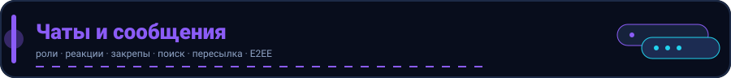

<p align="center">
  
</p>
# Чаты

Префикс: `/chats`. Все эндпоинты требуют `Bearer`.

## Список и создание

- `GET /chats` — мои чаты.
- `POST /chats/private` — `{ "user_id": "uuid" }` (приватный чат, идемпотентно).
- `POST /chats/group`

```json
{ "title": "Команда", "user_ids": ["uuid1", "uuid2"] }
```

- `GET /chats/{chat_id}` — информация о чате.
- `PUT /chats/{chat_id}` — `{ "title": "...", "avatar_url": "..." }`.
- `GET /chats/search?q=команда` — поиск чатов.

## Участники

- `GET /chats/{chat_id}/participants`
- `POST /chats/{chat_id}/participants` — `{ "user_id": "uuid" }`.
- `POST /chats/{chat_id}/participants/{user_id}/promote` — сделать админом чата.
- `POST /chats/{chat_id}/participants/{user_id}/demote` — снять админа.
- `DELETE /chats/{chat_id}/participants/{user_id}` — удалить участника.
- `POST /chats/{chat_id}/leave` — выйти из чата.
- `POST /chats/{chat_id}/e2ee/enable` — включить сквозное шифрование (E2EE) для
  чата (только `admin`/`owner`). Проставляет `encryption=e2ee`; после этого сервер
  хранит только шифротекст сообщений.

## Кэширование списка чатов

`GET /chats` кэшируется в Redis под ключом `chats:user:{userID}` (TTL 60с). Кэш
сбрасывается при любой мутации чата (создание, удаление участника, выход, смена
названия/аватара, включение E2EE, новое сообщение). При отключённом Redis
(`REDIS_ENABLED=false`) кэш прозрачно отключается.

## Mute и прочитанное

- `POST /chats/{chat_id}/mute` / `DELETE /chats/{chat_id}/mute`.
- `GET /chats/{chat_id}/unread` — число непрочитанных.
- `POST /chats/{chat_id}/read` — `{ "message_ids": ["uuid"] }` отметить прочитанным.
- `POST /chats/{chat_id}/typing` — индикатор «печатает» (шлёт событие в реалтайм).

## Закреплённые сообщения

- `POST /chats/{chat_id}/pin/{message_id}` / `DELETE /chats/{chat_id}/pin/{message_id}`.
- `GET /chats/{chat_id}/pinned`.

## Медиа чата

- `GET /chats/{chat_id}/media` — медиа-сообщения чата.
- `DELETE /chats/{chat_id}/messages` — очистить историю (soft-delete).
