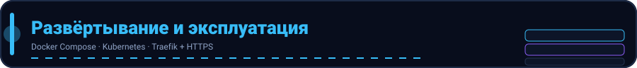

<p align="center">
  
</p>
# Развёртывание (Docker)

Полный стек описан в `docker-compose.yml`. Быстрый старт:

```bash
docker compose up -d --build
```

После старта:

- API: http://localhost:8080
- Swagger UI: http://localhost:8080/swagger/index.html
- PostgreSQL: localhost:5432 (jeogram/jeogram)
- Redis: localhost:6379
- Kafka: localhost:9092 (опционально, см. ниже)

## Минимальный запуск (только API + БД)

Для локальной проверки эндпоинтов достаточно `app` и `postgres`:

```bash
docker compose up -d --build app postgres
```

В `docker-compose.yml` Kafka и Redis **отключены** по умолчанию
(`REDIS_ENABLED=false`, `KAFKA_ENABLED=false`): приложение корректно работает без
них (in-memory rate-limit fallback, реалтайм в процессе). Чтобы включить полный
стек, задайте `REDIS_ENABLED=true`, `KAFKA_ENABLED=true` и верните `depends_on`
для `app` на `redis`/`kafka`.

## Переменные окружения (основные)

| Переменная | Назначение |
| --- | --- |
| `POSTGRES_*` | подключение к БД |
| `JWT_ACCESS_SECRET` / `JWT_REFRESH_SECRET` | секреты JWT (обязательно смените в проде) |
| `REDIS_ENABLED` / `REDIS_*` | кэш/ограничения |
| `KAFKA_ENABLED` / `KAFKA_*` | брокер событий |
| `SMTP_*` | отправка email (коды подтверждения) |
| `AUTH_REQUIRE_EMAIL_VERIFIED` | требовать подтверждение email для входа |
| `ADMIN_USER_IDS` | список admin UUID (`*` = все) |
| `RTC_*` | STUN/TURN для звонков |
| `MESSAGE_EDIT_WINDOW` / `MESSAGE_DELETE_FOR_ALL_WINDOW` | окна редактирования/удаления |

## Миграции

При старте на PostgreSQL применяются версионные миграции из
`internal/pkg/migrate/migrations/*.sql` (таблица `schema_migrations`), затем —
AutoMigrate для создания недостающих таблиц. На SQLite (тесты) используется
только AutoMigrate.

## Здоровье

- `GET /health` → `{"status":"ok"}`
- `GET /ready` → проверка БД.

## HTTPS через Traefik (авто-SSL, Let's Encrypt)

Сервер работает по HTTP (порт 8080). Для продакшена добавлен reverse-proxy
**Traefik**, который автоматически получает SSL-сертификат Let's Encrypt и
терминирует HTTPS, читая Docker-лейблы сервиса `app`.

1. В `.env` задайте домен и почту для ACME:

   ```dotenv
   DOMAIN=jeogram.example.com
   ACME_EMAIL=admin@example.com
   # ACME_CA_SERVER=https://acme-staging-v02.api.letsencrypt.org/directory  # для тестов (не банит лимиты)
   ```

2. Запустите стек с профилем `ssl`:

   ```bash
   docker compose --profile ssl up -d --build
   ```

   - Трафик на `80/443` принимает Traefik, `443` — HTTPS с авто-сертификатом.
   - `:8081` — дашборд Traefik (в `traefik.yml` включен `api.insecure`, для
     продакшена отключите и защитите).
   - Сертификаты хранятся в Volume `letsencrypt-data` (`/letsencrypt/acme.json`).

3. Если `DOMAIN` **пустой** — просто не используйте профиль `ssl`:

   ```bash
   docker compose up -d --build app postgres
   ```

   Приложение будет доступно по HTTP по IP/порту `8080` (для локальной разработки
   и тестов этого достаточно). Лейблы Traefik на сервисе `app` без запущенного
   Traefik игнорируются.

> Домен должен указывать (A/AAAA-запись) на публичный IP хоста, иначе Let's Encrypt
> не выпустит сертификат (HTTP-челлендж через порт 80).

