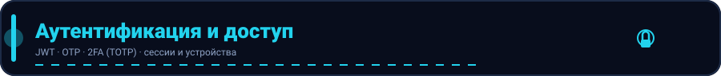

<p align="center">
  
</p>

#  E2EE: сквозное шифрование (prekey bundles)

Префикс: `/e2ee`. Все эндпоинты требуют `Bearer`.
Сервер выступает «слепым» хранилищем публичных материалов: приватные ключи
никогда не покидают устройство.

## Загрузка prekey-бандла

`PUT /e2ee/prekeys`

```json
{
  "prekeys": [
    { "key_id": "1", "public_key": "<base64>", "signature_key": "<base64>" },
    { "key_id": "2", "public_key": "<base64>", "signature_key": "<base64>" }
  ]
}
```

- Загруженный набор **заменяет** предыдущий набор пользователя.
- Массив обязателен: `prekeys` — минимум 1 элемент, каждое поле `key_id`,
  `public_key`, `signature_key` обязательны (иначе `422 validation_error`).
- Ответ: `{ "status": "uploaded", "count": 2 }`.

## Получение prekey собеседника

`GET /e2ee/prekeys/{user_id}`

Сервер выдаёт **один неиспользованный** ключ и сразу помечает его
использованным (one-time prekey, Signal-style). Если ключей не осталось —
`404 not_found` (`no prekey available`), клиент должен попросить собеседника
дозагрузить бандл.

Ответ:

```json
{
  "success": true,
  "data": {
    "user_id": "uuid",
    "key_id": "1",
    "public_key": "<base64>",
    "signature_key": "<base64>"
  }
}
```

## Как связаны E2EE-чаты и сообщения

- `POST /chats/{chat_id}/e2ee/enable` переводит чат в режим `encryption=e2ee`
  (только `admin`/`owner`). После этого сервер хранит только шифротекст:
  поле `text` содержит зашифрованную полезную нагрузку.
- Шифрование/расшифровка выполняются на клиентах; сервер не имеет priv-ключей
  и не может прочитать содержимое.

## Схема таблицы `e2ee_prekeys`

| Поле | Тип | Назначение |
| --- | --- | --- |
| `id` | uuid | первичный ключ |
| `user_id` | uuid | владелец ключа (индекс `idx_e2ee_prekeys_user`) |
| `key_id` | string(64) | идентификатор ключа на устройстве |
| `public_key` | text | публичный ключ (opaque для сервера) |
| `signature_key` | text | подпись публичного ключа |
| `used` | bool | выдан ли ключ (одноразовый) |
| `created_at` | time | время загрузки |

<p align="center">
  
</p>

> См. также: [Чаты](chats.md) · [Сообщения](messages.md) · [Аутентификация](auth.md)