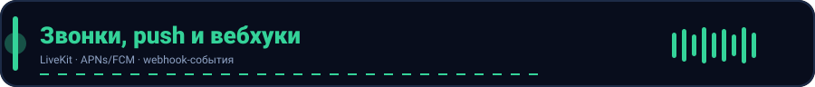

<p align="center">
  
</p>
# Webhook-уведомления

Сервер может отправлять исходящие HTTP-запросы (webhook) на внешние системы при
наступлении событий. Это позволяет интегрировать мессенджер с внешними сервисами
(CRM, аналитика, боты) без Kafka.

## Конфигурация (env)

| Переменная | По умолчанию | Назначение |
| --- | --- | --- |
| `WEBHOOK_URLS` | (пусто) | список URL через запятую, куда шлются события |
| `WEBHOOK_TIMEOUT` | `5s` | таймаут одного POST-запроса |

Пример:

```bash
WEBHOOK_URLS=https://hooks.example.com/jeogram,https://other.example.com/in
WEBHOOK_TIMEOUT=5s
```

## События

Webhook доставляется методом `POST` с `Content-Type: application/json` и телом:

```json
{
  "type": "message.created",
  "timestamp": "2026-08-24T12:00:00Z",
  "payload": { "chat_id": "uuid", "message_id": "uuid", "sender_id": "uuid" }
}
```

Доступные типы событий:

| `type` | Когда | Поля payload |
| --- | --- | --- |
| `user.registered` | регистрация пользователя | `user_id`, `email`, `phone` |
| `message.created` | отправка сообщения | `chat_id`, `message_id`, `sender_id`, `type` |
| `call.started` | начало звонка | `call_id`, `chat_id`, `initiator_id`, `mode` |

Доставка — асинхронная (fire-and-forget), не блокирует основной запрос. При
недоступности endpoint сервер логирует ошибку и продолжает работу.
